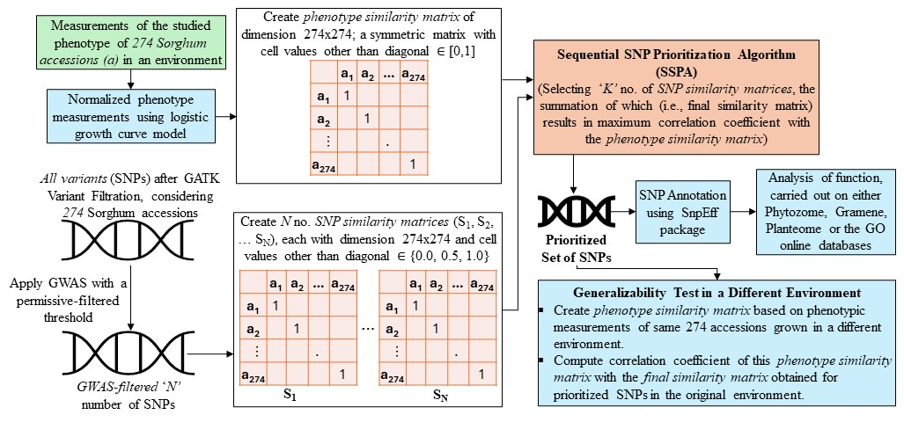

<h1>Post-GWAS Prioritization of  Genome-Phenome Associations in Sorghum
</h1>

## Abstract
Genome-wide association studies (GWAS) are widely used to infer the genetic basis of traits in organisms; however, selecting appropriate thresholds for analysis remains a significant challenge. In this study, we introduce the Sequential SNP Prioritization Algorithm (SSPA) to investigate the genetic underpinnings of two key phenotypes in Sorghum bicolor: maximum canopy height and maximum growth rate. Using a subset of the Sorghum Bioenergy Association Panel cultivated at the Maricopa Agricultural Center in Arizona, we performed GWAS with specific permissive-filtered thresholds to identify genetic markers associated with these traits, enabling the identification of a broader range of explanatory candidate genes. Building on this, our proposed method employed a feature engineering approach leveraging statistical correlation coefficients to unravel patterns between phenotypic similarity and genetic proximity across 274 accessions. This approach helps prioritize Single Nucleotide Polymorphisms (SNPs) that are likely to be associated with the studied phenotype. Additionally, we conducted a complementary analysis to evaluate the impact of SSPA by including all variants (SNPs) as inputs, without applying GWAS. Empirical evidence, including ontology-based gene function, spatial and temporal expression, and similarity to known homologs demonstrates that SSPA effectively prioritizes SNPs and genes influencing the phenotype of interest, providing valuable insights for functional genetics research.

<b>Link to paper:</b>  https://doi.org/10.3390/agronomy14122894

<b>Cite as:</b> Pal, D., Schaper, K., Thompson, A., Guo, J., Jaiswal, P., Lisle, C., Cooper, L., LeBauer, D., Thessen, A. E., & Ross, A. Post-GWAS Prioritization of Genome–Phenome Association in Sorghum. Agronomy, 14(12), 2894, 2024, doi: 10.3390/agronomy14122894

## Pipeline of Our Method

## Datasets Used:
* _Normalized_ phenotypic trait data for MAC Season 6: https://github.com/genophenoenvo/JAGS-logistic-growth

* Phenotypic trait data (end-of-season height) for Clemson for generalizability test: https://github.com/genophenoenvo/terraref-datasets 

* GWAS-filtered SNPs of _Sorghum Bicolor_ based on phenotypes maximum canopy height and maximum growth rate at various p-values: https://github.com/genophenoenvo/sorghum_data/releases/tag/v0.0.4

* All variants (SNPs) of _Sorghum Bicolor_: https://storage.googleapis.com/gpe-sorghum/whole-vcf-snp-arrays

## Files and Folders:
* **/target_correlation_matrix:** Contains phenotype similarity matrices created based on phenotypic measurements.
  
* **/SNP_outputs_v0.0.4:** Contains the list of candidate and prioritized SNP IDs extracted based on GWAS-filtered SNPs after execution our algorithm.

* **/SNP_outputs_v0.0.5:** Contains the list of candidate and prioritized SNP IDs extracted based on all SNPs after execution our algorithm.

* **/significant_SNPs:** TSV expansion of prioritized SNPs from the folders SNP_outputs_v0.0.4 and SNP_outputs_v0.0.5 showing snpEff annotation information.

* **/candidate_SNPs:** TSV expansion of candidate SNPs from the folders SNP_outputs_v0.0.4 and SNP_outputs_v0.0.5 showing snpEff annotation information.

* **/correlation_trend_v0.0.4:** Containining the plots depicting the correlation trend while adding SNPs to the "candidate" SNP list for the experiments based on GWAS-filtered SNPs.

* **/correlation_trend_v0.0.5:** Containining the plots depicting the correlation trend while adding SNPs to the "candidate" SNP list for the experiments based on all SNPs.

* **/codes:** Contains the codes used in this work.

* **/sorghum_panthar_outputs:**  
