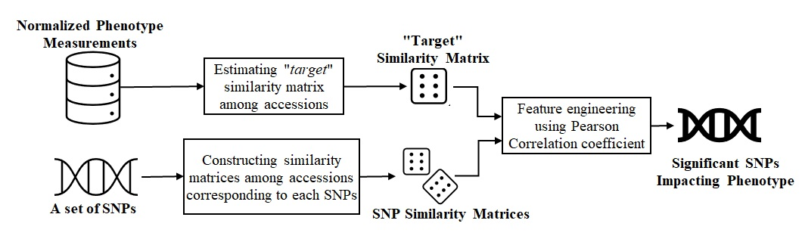

<h1>Phenotype to Genotype: Toward Determining Genetic Basis for Canopy Height Differences in Sorghum </h1>

<h3>Summary:</h3>
This work describes a novel approach to deduce the genetic basis of two phenotypes of Sorghum bicolor, viz., maximum canopy height and maximum growth rate. A subset of the Sorghum Bioenergy Association Panel was grown at the Maricopa Agricultural Center in Arizona as part of the TERRA-REF project, where various phenotype measurements were taken regularly throughout the growing season by an automated field scanner system and field scientists. In this work, we utilized a logistic growth curve model to normalize the phenotype measurements in order to account for the environmental variations. The differences in normalized phenotypic observations among accessions were used to build a “target" similarity matrix that describes the pairwise proximity of accessions. At the same time, multiple similarity matrices denoting pairwise genetic relatedness of 274 accessions were constructed based on the Single Nucleotide Polymorphisms (SNPs) identified using Genome-wide Association Studies; each of the SNP corresponds to a similarity matrix. Thereafter, we adopted a pattern recognition technique to identify which of these SNP similarity matrices are analogous to the “target” similarity matrix. This approach helped us identify the SNPs that are most likely to impact the phenotype of interest.

### Pipeline of Our Method

<h3>Details of Folder Structure:</h3>
  1. target_correlation_matrix: Contains target correlation matrix based on different phenotypyes from phenotypic observations 
  2. SNP_outputs: Containing the list of SNPs (effective list provides the set giving highest correlation coeeficient).
  3. SNP_outputs_annotated: TSV expansion of SNP_outputs showing snpEff annotation information
  4. correlation_trend: Containining the plots depicting the correlation trend while adding SNPs 
